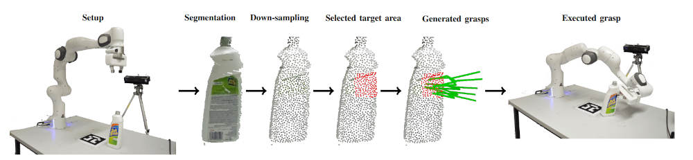

# Constrained Generative Sampling of 6-DoF Grasps

This repository provides the code for training VCGS, a position constrained generative 6-DoF grasp sampler, from the paper [Constrained Generative Sampling of 6-DoF Grasps](https://arxiv.org/pdf/2302.10745.pdf).

 


## Installation

This code has been tested with python 3.6, PyTorch 1.4 and CUDA 10.0 on Ubuntu
18.04. To install do

1) `pip3 install torch==1.4.0+cu100 torchvision==0.5.0+cu100 -f <https://download.pytorch.org/whl/torch_stable.html>`

2) Clone this repository: `git clone git@github.com:jsll/pytorch_6dof-graspnet.git`.

3) Clone pointnet++: `git@github.com:erikwijmans/Pointnet2_PyTorch.git`.

4) Run `cd Pointnet2_PyTorch && pip3 install -r requirements.txt`

5) `cd pytorch_6dof-graspnet`

6) Run `pip3 install -r requirements.txt` to install necessary python libraries.

7) (Optional) Download the trained models either by running `sh
   checkpoints/download_models.sh` or manually from [here](). Trained
   models are released under [CC-BY-NC-SA 2.0](TRAINED_MODEL_LICENSE).

## Download the dataset

You have three options to get the dataset:
1. Run the following script `bash dataset/download_dataset.sh`
2. Download it by clicking [this link](https://huggingface.co/datasets/jens-lundell/cong/resolve/main/full_dataset.zip). 
3. Go [here](https://huggingface.co/datasets/jens-lundell/cong) and download it manually.

The default position to place the dataset is in the `/dataset/` folder.

## Training

To train the position constrained grasp sampler or the evaluator with bare minimum configurations run:

```shell
python3 train.py 
```

To train the evaluator run:

```shell
python3 train.py 
```


## Citation

If this code is useful in your research, please consider citing:

```
@article{lundell2023constrained,
  title={Constrained generative sampling of 6-dof grasps},
  author={Lundell, Jens and Verdoja, Francesco and Le, Tran Nguyen and Mousavian, Arsalan and Fox, Dieter and Kyrki, Ville},
  journal={arXiv preprint arXiv:2302.10745},
  year={2023}
}
```

# License

The source code is released under [MIT License](LICENSE) and the trained weights are released under [CC-BY-NC-SA 2.0](TRAINED_MODEL_LICENSE).
